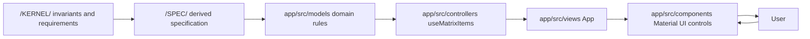
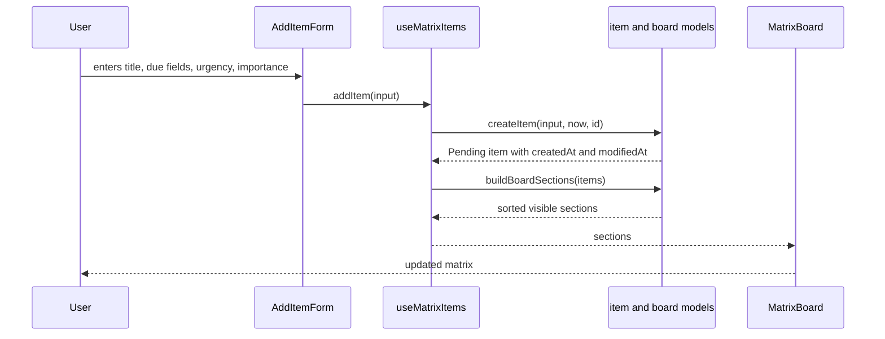
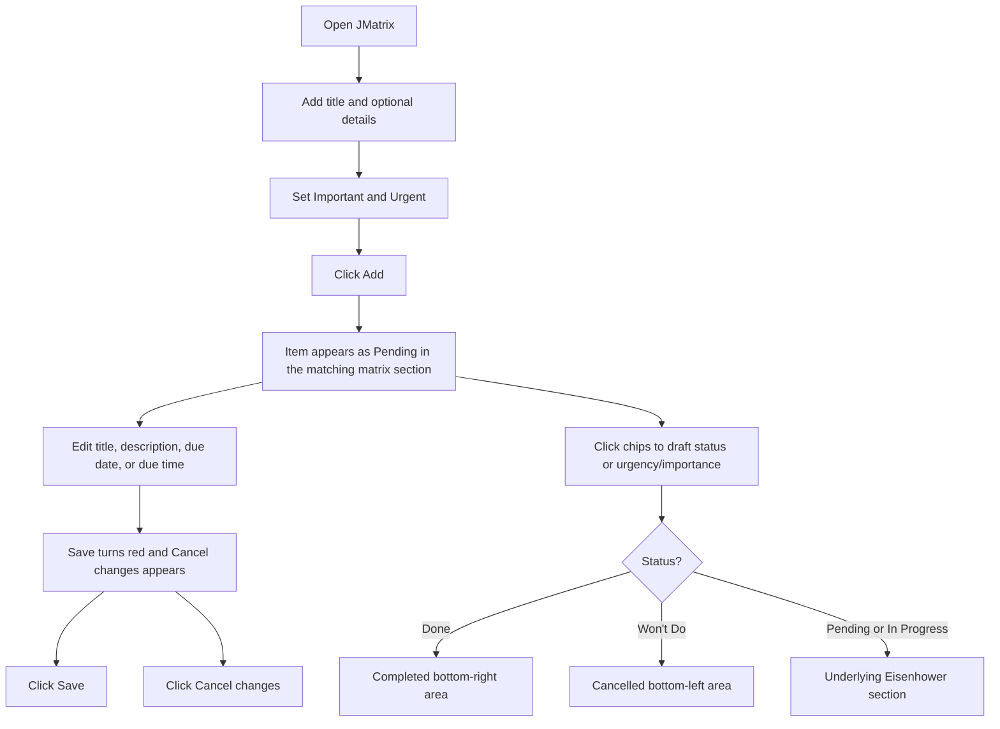

# JMatrix Architecture

JMatrix is a frontend-only MVP. The implementation follows the kernel preference for Domain Driven Design with MVC-style separation: domain rules live in `models`, React state orchestration lives in `controllers`, and Material UI rendering lives in `views` and `components`.

## System Design



## Runtime Flow



## User Journey



## Domain Rules

- The board always defines the four underlying Eisenhower sections.
- Items require `title`, `urgent`, `important`, `createdAt`, `modifiedAt`, and `status`.
- Optional item data is `description` and `dueAt`.
- `createdAt` is assigned once and preserved by updates.
- `modifiedAt` changes whenever an item is saved or toggled.
- Item edits, including status, urgency, and importance, stay local to the card until Save.
- Unsaved item edits make Save red and reveal Cancel changes.
- Status cycles through `Pending`, `In Progress`, `Done`, and `Won't Do`.
- Visible sections sort by due date/time soonest first, status precedence, then latest `modifiedAt`.
- Completed and Cancelled sections use distinct light backgrounds, and their items are collapsed by default.
- Sections with multiple items collapse all items by default.
- Expanded items are height-constrained and descriptions show at most two lines.
- The matrix uses shared Important and Urgent area labels rather than repeated quadrant labels.

## Validation

The current validation commands are:

```bash
cd app
npm test
npm run build
```
